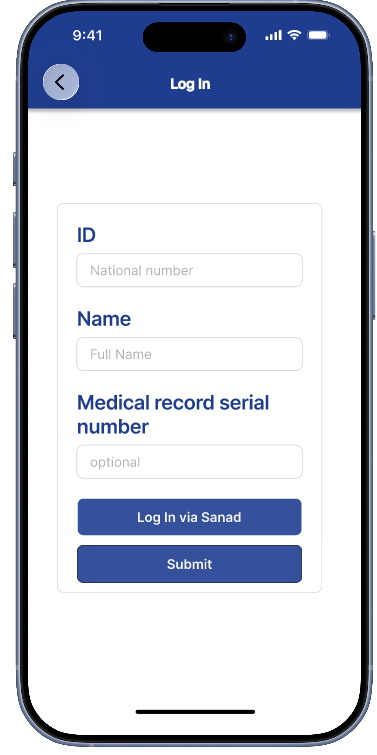

# Smart Emergency Assistance

UI/UX design prototype for a smart healthcare and emergency assistance mobile application created using Figma.

## All Screens

## Welcome Screen

## Login Screen

## Home Screen

## Risk Assessment Screen

## SOS Screen

## Appointment Booking Screen

## Data Confirmation Screen

## Figma Design

https://www.figma.com/design/1bO8DPNdf0xACgEtxbs0dz/Final-project--Smart-Emergency-Assistance

## Tools Used

- Figma
- UI/UX Design
- Mobile Application Design

## Academic Project

This project was developed as part of a university course.
